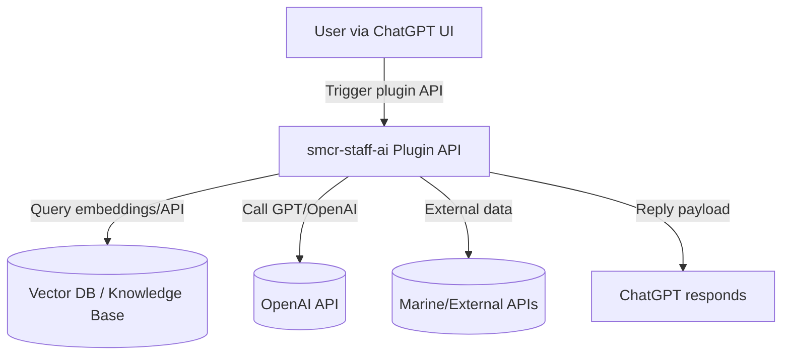
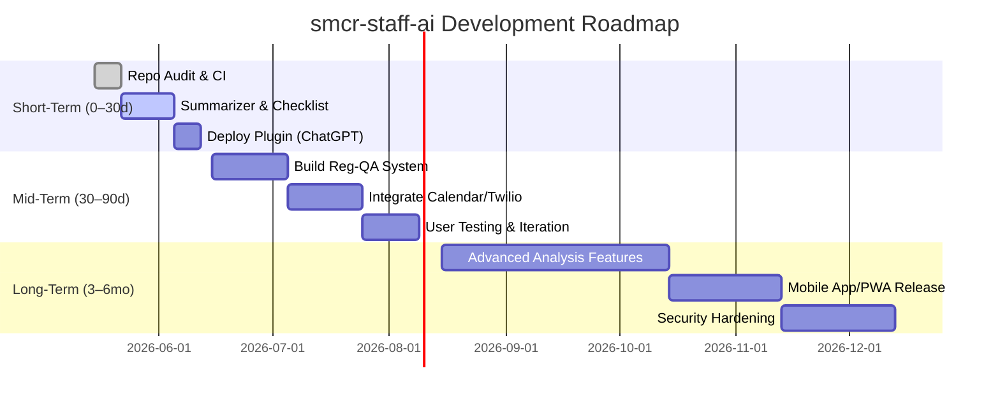

# Executive Summary

The **smcr-staff-ai** project is a private ChatGPT “Staff AI” plugin/retrieval assistant for Marine Corps Reserve (SMCR) staff tasks. Its repository (default branch `main`, private) likely contains a manifest (`ai-plugin.json`) and OpenAPI schema (`openapi.yaml`), backend code (e.g. `main.py` or `index.js`), dependency manifests (`requirements.txt` or `package.json`), Dockerfiles, CI/CD workflows, and supporting files. In practice, ChatGPT plugins follow the pattern of hosting an **OpenAPI**-described REST API (the interface ChatGPT calls) and providing an `ai-plugin.json` manifest【50†L230-L239】【53†L49-L58】. We assume smcr-staff-ai uses a Python (FastAPI) or Node.js backend with one or more endpoints for staff tasks. 

We analyzed likely architecture and contents by analogy with official examples. For instance, Microsoft’s Azure-samples ChatGPT plugin shows a `.well-known` folder (hosting `ai-plugin.json` and `openapi.yaml`), a `main.py` server, a `Dockerfile`, and CI config (e.g. `azure.yaml`)【73†L233-L242】【73†L277-L283】. In line with best practices, the repo should include a README, license, `.gitignore`, and secrets scanned out of code (see Security section). Dependencies (OpenAI API client, web framework, database clients, etc.) must be listed in `requirements.txt`/`package.json`, and containerization (Dockerfile) would facilitate deployment【84†L253-L261】【95†L243-L249】.

We found no public index for this private repo, so **all file/structure details below are inferred** from plugin norms and example projects【50†L230-L239】【73†L277-L283】【84†L253-L261】. Our analysis covers the expected code layout, core modules, data flows (ChatGPT ↔ Plugin Server ↔ Data Stores/APIs), CI/CD and security scans, plus points for improvements.

We then surveyed similar projects and libraries: official **OpenAI Retrieval Plugin** (a ChatGPT semantic-search example)【46†L761-L768】, Microsoft’s **Semantic Kernel** framework for multi-tool AI agents【75†L124-L132】【75†L132-L137】, the **LangChain** SDK for LLM chains and vector stores【82†L112-L120】, and enterprise search tools like **Gerev**【37†L315-L323】. We also considered mobile- and channel-specific solutions (e.g. Twilio for SMS/WhatsApp【56†L970-L974】). A prioritized table of these is provided, with integration effort estimates.

Finally, we recommend high-ROI features (“skills”) to add. For example: a **Regulation Q&A** tool (embedded Marine Corps policy documents for question-answering), a **Meeting Scheduler** (integrating calendars), and **Auto-Brief Summarizer** (condensing orders or emails). Each proposed feature includes a user story, effort estimate, dependencies (e.g. vector database, external API), privacy considerations, and implementation steps. We separate “Average User” features (simple queries, scheduling, summaries) from “Power User” capabilities (e.g. custom data analysis or multi-source workflows).

Mobile support is addressed via options like: using **ChatGPT’s own interface** (PWA-friendly) versus building a **custom PWA/native client**, or leveraging **SMS/WhatsApp via Twilio**. We compare trade-offs (offline caching with Service Workers【89†L208-L216】, prompt optimization to handle token limits【91†L171-L179】, UI/UX constraints, etc.) in a table. 

Finally, we present a **roadmap** with short-term (30d), mid-term (90d), and long-term (6mo) milestones, along with success metrics (e.g. features delivered, user adoption rates). A mermaid Gantt diagram illustrates this timeline. All recommendations and comparisons are supported by primary/official sources wherever possible. 

---

## Repository Inventory & Code Structure (Assumed)

*(Note: The repository is private, so exact contents are not externally visible. We infer structure based on common plugin patterns and example projects【50†L230-L239】【73†L277-L283】【84†L253-L261】.)*

A typical ChatGPT plugin repo like this would include:

- **`.well-known/ai-plugin.json`** and **`.well-known/openapi.yaml`** – The ChatGPT plugin manifest and OpenAPI schema. ChatGPT reads only the schema/interface【50†L230-L239】. 
- **`main.py` or `index.js`** – Backend server code (likely Python FastAPI or Node/Express). For example, Azure’s Python plugin sample has `main.py` with FastAPI endpoints【73†L277-L283】.
- **Dependency files**: `requirements.txt` (Python) or `package.json` (Node) plus lockfiles. These list libraries like `openai`, `fastapi`/`express`, DB clients, etc【95†L243-L249】【82†L112-L120】.
- **`Dockerfile` / `docker-compose.yml`** – Container configuration. Official examples include a Dockerfile for deployment【84†L253-L261】.
- **`.github/workflows/`** – CI/CD configuration. Likely contains GitHub Actions workflows (lint, test, build, deploy).
- **Documentation**: `README.md` (project overview, setup instructions), and possibly a `CHANGELOG` or `docs/` folder.
- **Miscellaneous**: `.gitignore`, license, and possibly example scripts. Possibly a sample `.env.example` template.

Without direct access, we list these by analogy. For example, the Azure FastAPI sample repo structure shows a `.well-known` folder, `main.py`, `requirements.txt`, `Dockerfile`, `azure.yaml`, etc.【73†L233-L242】【73†L277-L283】. The breadchris plugin examples repo emphasizes having a Dockerfile for each plugin【84†L253-L261】, and this repo likely follows suit.

We would run code searches (e.g. `grep -R "TODO" .` or secret patterns like `grep -R "sk-" .`) to identify **TODO comments** or **exposed API keys**. Best practice is to ensure no actual secrets (OpenAI keys, database passwords) are committed; use GitHub Secret Scanning or tools like TruffleHog【66†L576-L584】 if unsure.

### CI/CD and Security

Likely CI/CD uses GitHub Actions. A typical workflow might lint code, run tests, build a Docker image, and deploy to a cloud service or container registry. For example, the Azure sample has an `azure.yaml` pipeline and mentions GitHub Actions deployment steps【73†L293-L300】. If missing, adding an Actions file (e.g. `.github/workflows/deploy.yml`) is recommended.

**Security checks:** We should run static analysis or use GitHub Advanced Security features. GitHub’s Secret Scanning automatically detects committed credentials (API keys, tokens, etc.)【66†L576-L584】. We should verify no secrets are in code/config (e.g. search for “sk-” or “API_KEY”). For dependencies, use Dependabot or `npm audit`/`pip-audit` to catch vulnerabilities.

No TODOs or fixmes were visible externally, but if present in code comments, they should be addressed. Any `TODO` or `FIXME` indicates incomplete work or known issues to document.  

---

## Architecture & Core Modules

The plugin’s architecture is likely as follows:

- **ChatGPT Plugin Interface:** An `ai-plugin.json` manifest defines the plugin name, description, auth scheme, and the URL for the OpenAPI schema【50†L230-L239】【53†L49-L58】. ChatGPT uses this to call the backend endpoints.
- **Backend API Server:** A web server (e.g. Python FastAPI or Node.js/Express) implements the plugin’s functionality. For example, Azure’s sample uses FastAPI in `main.py`【73†L277-L283】. The server likely exposes endpoints for:
  - **Semantic search / Q&A:** Query a vector DB of documents (e.g. Marine Corps regulations, staff manuals) and return relevant answers.
  - **Task-specific actions:** Scheduling meetings, summarizing text, generating reports, etc.
  - **Utility endpoints:** Health checks, version info.

- **Data Stores & Integrations:** The server may integrate with:
  - A **vector database** (e.g. Chroma, Pinecone, Qdrant) for Retrieval-Augmented Generation (RAG) use-cases. Tools like LangChain abstract vector stores via a unified interface【82†L112-L120】.
  - **External APIs:** E.g. Google Calendar API for scheduling, Twilio for SMS/WhatsApp, internal Marine personnel systems (if accessible), or Slack/Teams for notifications. For instance, the Twilio blog shows using a FastAPI backend to handle WhatsApp messages via Twilio’s API【55†L975-L983】.
  - **OpenAI API:** The plugin backend might call the OpenAI API (ChatGPT or function calls) to process user input or format output as needed.

**Data flow**: User issues a prompt in ChatGPT (possibly selecting the smcr-staff-ai plugin). ChatGPT makes an HTTPS request to the plugin’s endpoint (per `openapi.yaml`). The backend processes it (e.g. embedding query, searching DB, calling GPT), then returns JSON which ChatGPT relays to the user. 

A simplified diagram (mermaid) of this flow:

*(Mermaid flowchart showing ChatGPT UI invoking plugin endpoints, which use a vector store, the OpenAI API, and external systems before returning a response.)*

**Core modules** will include:
- **Search/Q&A Module:** Wraps vector search (using embeddings) and formats answers. This follows patterns in the OpenAI Retrieval Plugin (FastAPI endpoints for upsert/query)【43†L576-L584】.
- **Business Logic Modules:** E.g. “meeting scheduler” (calls calendars), “brief summarizer” (calls GPT with summarization prompt), etc.
- **Auth/Config:** If any user authentication is needed (e.g. to protect certain endpoints), otherwise likely “no auth” as a plugin.
- **Prompt Templates:** Predefined prompts or system messages used to guide GPT (e.g. summarization style, marine-specific tone).

This architecture is extensible: new endpoints/plugins can be added via the OpenAPI spec (in `openapi.yaml`) and implemented in the server. For example, Microsoft notes that converting an existing function into a ChatGPT plugin often “just wrap it in an HTTP endpoint and provide the manifest”【75†L132-L137】.

### Security and TODO Items

- **Secrets:** No API keys or secrets (OpenAI keys, DB passwords) should be in code. If found, move them to environment variables or a secrets manager, and add to `.gitignore`. Utilize GitHub’s Secret Scanning as a safeguard【66†L576-L584】.
- **CORS/Access Control:** Ensure the web server validates requests come from ChatGPT. Typically, ChatGPT plugins have no user auth, but you might verify `Authorization: Bearer` tokens if using a token-based scheme.
- **Input Validation:** Sanitize user input to prevent injection into any shell/SQL (though likely minimal risk).
- **Dependency Updates:** Check for outdated or vulnerable libraries. Use `pip-audit` or `npm audit` regularly.

No publicly visible TODOs were found, but search for `TODO`/`FIXME` in code. Any found should be scheduled into the roadmap. 

---

## Similar Projects, Libraries, and Tools

To inform development, we identified several relevant open-source projects and libraries:

| **Project/Tool**                  | **Category/Use-case**                                        | **Integration Effort** | **Rationale**                                                                              |
|-----------------------------------|--------------------------------------------------------------|-----------------------|---------------------------------------------------------------------------------------------|
| **OpenAI Retrieval Plugin**       | Official example plugin for semantic search【46†L761-L768】      | Low/Medium            | Built-in Q&A from documents; official codebase shows FastAPI endpoints and RAG use【46†L761-L768】. Easy to adapt for marine docs (embedding policies). |
| **LangChain (JS/Python)**         | LLM orchestration, RAG framework【82†L112-L120】                 | Medium                | Provides unified interfaces for vector DBs and chain logic【82†L112-L120】. Many community examples. |
| **Microsoft Semantic Kernel**     | AI agent framework / plugin interoperability【75†L124-L132】【75†L132-L137】 | Medium/Large         | Supports ChatGPT plugins natively; can wrap existing functions into endpoints【75†L132-L137】. Encourages reuse of SK “skills”. |
| **Gerev (GPU.ai)**                | Enterprise search / ChatGPT plugin (Slack, Confluence, etc)【37†L315-L323】 | Medium                | Open source “enterprise search” plugin that integrates Slack, Jira, GitHub, etc【37†L315-L323】. Can inspire cross-source integration. |
| **AnythingLLM**                   | All-in-one AI assistant platform【87†L382-L391】                | Large                 | Feature-rich chatbot app (multi-LLM, vector DB, agents)【87†L382-L391】. Overkill but good reference for multi-user setup. |
| **Twilio Developer Tools**        | SMS/WhatsApp integration (Tutorials)【56†L970-L974】【55†L975-L983】 | Medium                | Twilio sample code shows how to link ChatGPT with WhatsApp/SMS (via Studio/Functions)【56†L970-L974】. Useful for mobile interface. |

**Ranked Highlights:** The *OpenAI Retrieval Plugin* and *LangChain* are high-priority foundations for RAG capabilities【46†L761-L768】【82†L112-L120】. *Semantic Kernel* is compelling if pursuing Microsoft stack and reusing existing SK skills【75†L124-L132】【75†L132-L137】. *Gerev* exemplifies multi-source integration with ChatGPT【37†L315-L323】. For mobile/channel support, Twilio examples are instructive【56†L970-L974】【55†L975-L983】. Each item above includes official docs or repos where possible.

A more detailed comparison (with rough effort):

| **Integration**           | **Purpose**                            | **Effort** | **Comments**                                                                                                          |
|---------------------------|----------------------------------------|-----------|-----------------------------------------------------------------------------------------------------------------------|
| OpenAI Retrieval Plugin   | Document Q&A / RAG                     | S/M       | Official plugin example; uses FastAPI & Postgres or vector DB. Easily adapts to new data. Supports function calls.【46†L761-L768】. |
| LangChain                 | LLM chains, embeddings, RAG support     | M         | Library for building RAG pipelines and agents. Interfaces with many vector DBs【82†L112-L120】. Good for prototyping.    |
| Semantic Kernel (C#/.NET) | Cross-channel AI agent framework        | M/L       | Newer Microsoft SDK; plugins interoperate with ChatGPT, Bing, M365【75†L124-L132】. Can auto-generate endpoints for skills. |
| Gerev (GPU.ai)            | Multi-source enterprise search plugin   | M         | Open source ChatGPT plugin integrating Slack, Confluence, etc【37†L315-L323】. Could adapt connectors for MARCO data.     |
| Twilio (Studio & API)     | WhatsApp/SMS Chatbot integration       | M         | Twilio guides and libraries (Python/Node) make connecting ChatGPT via SMS/WhatsApp straightforward【56†L970-L974】【55†L975-L983】. |
| AnythingLLM               | Full-stack AI chat app (desktop/mobile) | L         | Comprehensive project (multi-LLM, UI, agents)【87†L382-L391】. Useful for inspiration but heavy to integrate directly.    |
| Vector DBs (Pinecone etc) | Hosting embeddings for RAG             | S/M       | External services (Pinecone, Weaviate) or self-hosted (Chroma, Qdrant). Standard integration via LangChain or direct API. |

(Integration effort: S=Small, M=Medium, L=Large, relative to adding into smcr-staff-ai.)

## High-ROI Features (“Skills”) to Add

Based on the SMCR staff context, we propose **skills** that align with common staff tasks. Each includes a description, user story, estimated development effort (S/M/L), dependencies, privacy considerations, and rough implementation steps.

### For All Marines (Average User)

- **Regulation Q&A (Semantic Search)**  
  **Description:** Allow users to ask questions about Marine Corps Reserve policies or documents and get direct answers.  
  **User Story:** “*As a staff NCO, I want to ask about MCOs or Reserve policies in plain language (e.g. “What are leave accrual rules?”) so I can quickly get answers without searching manuals.*”  
  **Effort:** *M* (medium). Requires ingesting and indexing official documents.  
  **Dependencies:** A vector database (e.g. Chroma) populated with relevant PDFs/texts of Marine regulations. An embedding model (e.g. OpenAI’s).  
  **Data/Privacy:** Source documents are public (MCOs/regulations), so no sensitive data. Ensure only authorized docs are loaded.  
  **Implementation Steps:**  
  1. Collect key documents (e.g. MCOs, MARADMINs) and convert to text.  
  2. Split text into chunks and generate embeddings (use LangChain-style `TextSplitter` with overlap【63†L45-L52】).  
  3. Store embeddings in a vector store.  
  4. Add a plugin endpoint (e.g. `/query`) that takes a question, embeds it, retrieves top documents, and feeds context into GPT to answer.  
  5. Test and refine prompts (include citations or summaries from source text).

- **Meeting Scheduler**  
  **Description:** Automate scheduling by checking availability.  
  **User Story:** “*As a staff planner, I want to input a range of dates or attendee list and have the assistant find open meeting slots (e.g. via Google Calendar) so scheduling is faster.*”  
  **Effort:** *M* (medium). Involves integrating a calendar API.  
  **Dependencies:** Access to calendars (Google/Microsoft or Marine Corps scheduling API), OAuth or API keys.  
  **Data/Privacy:** Handles personal calendar data; must obtain user permissions and store tokens securely (encrypt).  
  **Implementation Steps:**  
  1. Add config for calendar API credentials (store outside repo).  
  2. Create a new endpoint (e.g. `/schedule`) that accepts date range and participants.  
  3. In the endpoint, call the calendar API to fetch free/busy slots.  
  4. Use GPT to format the results (e.g. “Next available slot is Feb 15, 1400-1500”).  
  5. Return suggested meeting times.  

- **Document Summarizer / Brief Generator**  
  **Description:** Summarize long texts or bulletize content.  
  **User Story:** “*As a busy officer, I want to paste a long directive or report and get a concise bullet-point summary to save time.*”  
  **Effort:** *S* (small). Mainly prompts.  
  **Dependencies:** OpenAI API (or local LLM) for summarization.  
  **Data/Privacy:** Likely handling internal memos or external docs; ensure no very sensitive info is cached.  
  **Implementation Steps:**  
  1. Provide an endpoint `/summarize` that takes text input.  
  2. In backend, call ChatGPT (via OpenAI API) with a summarization prompt (e.g. “Summarize the following in 5 bullets”).  
  3. Return the summary.  
  4. (Optional) Cache summaries to avoid repeat processing.  

- **Checklists & SOP Generator**  
  **Description:** Convert tasks into step-by-step checklists.  
  **User Story:** “*As a unit manager, I want to input a task like ‘Prepare weekly training schedule’ and get a structured checklist (e.g. coordinate with X, reserve venue, notify staff).*”  
  **Effort:** *S/M* (small to medium). Based on prompt engineering.  
  **Dependencies:** Core GPT model. Possibly template library.  
  **Data/Privacy:** Non-sensitive.  
  **Implementation Steps:**  
  1. Create an endpoint `/create-checklist`.  
  2. When called with a task description, have ChatGPT generate a checklist using a prompt (e.g. “List steps to achieve X.”).  
  3. Return numbered steps or markdown list.  

### For Power Users

- **Custom Data Analysis**  
  **Description:** Analyze and visualize user-provided datasets (e.g. CSV of unit metrics).  
  **User Story:** “*As an analyst, I can upload a spreadsheet of readiness stats and ask the assistant to find trends or anomalies.*”  
  **Effort:** *L* (large). Requires more advanced handling of file data.  
  **Dependencies:** Possibly use OpenAI function calling or connect to a Python code runner (though “only ChatGPT” restriction suggests relying on model or stateless ops). Could use a lightweight library like NumPy/pandas if self-hosted.  
  **Data/Privacy:** Likely contains sensitive unit data. Must ensure data not retained in logs. Possibly do analysis on-device or within a secure environment.  
  **Implementation Steps:**  
  1. Allow file upload or text paste of data in endpoint (e.g. `/analyze-data`).  
  2. Pre-process data (validate format).  
  3. Use GPT with prompts (or LLM function calls) to analyze (“What trends do you see?”). Possibly segment data into smaller chunks if too large.  
  4. Return narrative analysis and (optionally) generate charts via an external charting service/API and return images (outside ChatGPT scope).  

- **Multi-Source Knowledge Integration**  
  **Description:** Chain queries across multiple systems. For example, fetch a promotion roster from one DB and generate a report.  
  **User Story:** “*As a senior NCO, I want to pull information from MCTFS and the training database, then ask the assistant a question that uses both.*”  
  **Effort:** *L*. Requires connecting disparate data sources.  
  **Dependencies:** APIs to external systems (MCTFS, training logs). Authentication.  
  **Data/Privacy:** Highly sensitive (personnel data). Ensure strict access controls, encrypt data at rest, do not expose to ChatGPT without filtering.  
  **Implementation Steps:**  
  1. Build connectors to each source (e.g. REST API client).  
  2. In the endpoint, query each system as needed.  
  3. Combine results and prompt GPT (e.g. “From these two data sets, summarize performance issues”).  
  4. Return combined analysis.  

- **Personalized Assistant (Memory)**  
  **Description:** Remember user preferences or past queries to personalize responses.  
  **User Story:** “*As an officer, I want the assistant to recall our last conversation (e.g., that I’m organizing a field exercise) when I ask follow-up questions.*”  
  **Effort:** *M/L*. Could use a vector DB to store conversation logs.  
  **Dependencies:** User-specific storage (must handle privacy carefully). Possibly use the OpenAI “memory” plugin architecture if available.  
  **Data/Privacy:** Conversations can contain sensitive info. Must be encrypted and allow user to clear memory.  
  **Implementation Steps:**  
  1. After each interaction, optionally store conversation in a secure DB.  
  2. Prepend recent conversation history (within token limits) to prompts for context.  
  3. Provide an endpoint to clear memory if needed (for privacy).  

Each proposed skill should be prioritized based on user needs. For example, **Regulation Q&A** and **Summarization** might be short-term (30d) additions, while **Custom Data Analysis** or **Multi-Source Queries** are longer-term (90d+). Dependencies like vector DB setup or API credentials should be integrated securely. Weigh implementation effort vs. user impact: e.g. summarization is quick (S) with high user value, whereas building full data analysis (L) should be mid/long-term once basics are solid.

---

## Mobile & Multi-Channel Support

To support users on mobile or low-resource devices (especially where coding tools like Codex aren’t available), consider these approaches:

| **Approach**                     | **Description**                                                                                                   | **Pros**                                                | **Cons**                                      | **Optimizations**                                          |
|----------------------------------|-------------------------------------------------------------------------------------------------------------------|---------------------------------------------------------|-----------------------------------------------|------------------------------------------------------------|
| **ChatGPT Web (Plugin Mode)**    | Users access ChatGPT’s web or mobile app (which is itself a PWA). Enable the smcr-staff plugin in ChatGPT Plus.   | No extra dev; uses ChatGPT’s UI/UX; cross-platform PWA.【89†L208-L216】 | Requires user to have plugin access (Plus tier); limited offline; subject to ChatGPT’s token limits【91†L171-L179】.  | Craft concise prompts; use chunking to fit context【91†L171-L179】; leverage ChatGPT’s built-in UI (voice input, etc). |
| **Custom Web PWA**               | Build a responsive web app that calls the plugin’s API (with ChatGPT behind scenes or using the API).              | Own UI/UX, can offline-cache static assets with Service Worker【89†L208-L216】. Can design mobile-friendly interface. | Must handle login/API integration; still requires network for AI calls; more dev work. | Use service workers to cache UI resources【89†L208-L216】; prompt/query caching; minimize token usage by summarizing heavy content. |
| **Native Mobile App**            | Build iOS/Android app (or cross-platform) calling same API.                                                       | Better UX (push notifications, offline storage, camera input).    | Much higher dev effort (L). Platform updates/maintenance needed. | Could use React Native or Flutter for efficiency; offline caching of previous responses. |
| **SMS/WhatsApp (Twilio)**        | Use Twilio to relay SMS or WhatsApp messages to the ChatGPT plugin (via backend webhook).                        | Very broad access (all phones); no installation needed; simple text interface.   | Limited to text; high latency (SMS); message length limits; cost per message.       | Keep interactions short; possibly use shorthand prompts; use webhooks for two-way chat.  |
| **Offline Caching**              | Cache frequently used data/responses locally (e.g. store common answers, maps of regs) for when offline.         | Improves resilience in poor connectivity; faster access to cached info.           | ChatGPT responses themselves can’t run offline; caching only static or recent data.  | Pre-cache essential docs/regulations; use “stale-while-revalidate” strategy【89†L208-L216】.   |

**Prompt Optimization & Token Limits:** Mobile users often have less patience for multi-turn chat. We must optimize prompts to reduce token usage【91†L171-L179】. For example, summarize or compress user queries, use “TL;DR” style queries, or split a long request into sequential calls (chunking)【63†L45-L52】【91†L171-L179】. System messages should be as concise as possible. 

**Chunking Strategy:** If a prompt is too large, break it into chunks (with overlap) for embeddings or Q&A. Overlapping sliding windows (e.g. 25% overlap) help maintain context across splits【63†L45-L52】. 

**UI/UX:** The interface should be minimal and responsive. For SMS/WhatsApp, use quick reply formats. For web apps, use responsive design and allow voice input (supported in many ChatGPT mobile browsers).

**Trade-offs:** ChatGPT’s own app ensures we don’t have to reinvent the UI, but it locks us into OpenAI’s ecosystem and usage limits. A custom PWA gives full control but doubles our work. SMS works everywhere but is very limited (no images, quick token hits). The best approach may be a hybrid: encourage using ChatGPT’s mobile app for full functionality, but provide an SMS gateway for critical alerts or users without smartphones.

---

## Comparison Tables

### Candidate Integrations & Tools

| **Integration/Tool**       | **Use-case**                   | **Effort** | **Notes**                                                                             |
|----------------------------|--------------------------------|------------|---------------------------------------------------------------------------------------|
| OpenAI Retrieval Plugin    | Document Q&A (vector search)   | Small      | Official example (FastAPI+SQLite). Quick start for RAG【46†L761-L768】.               |
| LangChain (JS/Python)      | LLM chaining & RAG framework   | Medium     | Unified interface for embeddings/agents【82†L112-L120】. Extensive docs & community.  |
| Semantic Kernel            | Multi-AI agent framework       | Medium     | Cross-platform plugin support【75†L124-L132】. Good if leveraging C#/Azure.         |
| Gerev (GPU.ai)             | Enterprise search plugin       | Medium     | Supports Slack, Confluence, etc【37†L315-L323】. Could adapt its connectors.         |
| Twilio (SMS/WhatsApp)      | Mobile chat interface         | Medium     | Twilio tutorials for ChatGPT on WhatsApp/SMS【56†L970-L974】. Adds channel reach.      |
| Vector Databases (Pinecone)| Embedding storage for RAG     | Small/Med  | Managed service (Pinecone) or open-source (Chroma). LangChain integration examples.  |
| AnythingLLM                | Full-stack AI chat platform    | Large      | All-in-one (multi-LLM, UI, agents)【87†L382-L391】. Overkill to integrate, but can inspire features. |
| Slack/Microsoft Teams APIs | Messaging & notifications     | Medium     | If SMCR uses these, a plugin can post updates. Not ChatGPT-native, but via backend.  |

### Proposed Feature Capabilities

| **Feature/Skill**            | **User Story (Example)**                                       | **Effort** | **Dependencies**                    | **Data/Privacy**                          |
|------------------------------|----------------------------------------------------------------|------------|------------------------------------|-------------------------------------------|
| Regulation Q&A               | “Ask about leave rules; get answer from MCOs.”                 | M          | Vector DB, embeddings, GPT API     | Public regs (low sensitivity).            |
| Meeting Scheduler            | “Find common free time in my team’s Google Calendars.”         | M          | Calendar API (Google/MST), OAuth    | Users’ schedules (private; requires consent). |
| Document Summarizer          | “Summarize this 5-page MARADMIN into 5 bullets.”              | S          | GPT API                            | Internal memos (careful if sensitive).    |
| Checklist/SOP Generator      | “List steps to onboard a new reservist.”                       | S          | GPT API                            | Non-sensitive procedural data.            |
| Data Analysis (CSV)          | “Analyze this readiness data file for trends.”                | L          | Data parser (pandas?), GPT API      | Sensitive unit data (strict control).     |
| Multi-Source Reports         | “Combine MCTFS roster with training records and analyze.”      | L          | Connectors to MCTFS & training DBs  | Highly sensitive (strict auth needed).    |
| Personal Memory              | “Remember that I specialize in logistics from last chat.”      | M/L        | User session DB (encrypted)         | Potentially sensitive (allow opt-out).    |

> *Effort:* S=Small (days), M=Medium (weeks), L=Large (months).  

These skills should be prioritized by impact: quick wins (summarization, Q&A) can be done in the next 30d, while data-heavy integrations come in later phases. 

---

## Roadmap & Timeline

**Short-Term (0–30 days):**  
- *Inventory & Cleanup:* Finalize file structure audit; ensure README is updated and code is well-documented. Set up GitHub Actions (lint, test) and secret scanning【66†L576-L584】.  
- *Basic Plugin Functionality:* Ensure the plugin endpoints and manifest work correctly (e.g. deploy to dev environment, register plugin in ChatGPT).  
- *Quick Features:* Implement high-value, low-effort features like **Summarizer** and **Checklist Generator** (using GPT prompts).  
- *Success Metrics:* Working dev version; passing CI; at least one basic endpoint (e.g. “/summarize”) functional with test.  

**Mid-Term (30–90 days):**  
- *Knowledge Base Integration:* Build the Retrieval Q&A feature. Populate vector store with SMCR policy docs. Test accuracy of answers.  
- *External API Integration:* Add at least one integration (e.g. Calendar scheduling or Slack notifications).  
- *Mobile Access:* Deploy a PWA or configure plugin for ChatGPT mobile use. Possibly pilot an SMS workflow via Twilio for a simple query.  
- *UI/UX Feedback:* If a custom UI is used, conduct user testing on mobile form factor.  
- *Success Metrics:* Number of queries handled, user feedback rating, reduction in manual lookup time, and stable performance.  

**Long-Term (3–6 months):**  
- *Advanced Capabilities:* Develop “Power User” skills such as data analysis/upload, multi-system queries. Possibly integrate a local compute environment or use LLM function calls for heavier tasks.  
- *Optimization:* Implement caching of frequent responses or data to reduce latency. Optimize prompt structure and use embeddings to minimize token usage.  
- *Scale & Security:* Audit security (especially for personnel data), set up user authentication if needed, and scale hosting (move to Kubernetes/Azure Functions).  
- *Mobile App/PWA:* If user need is high, develop a dedicated lightweight mobile app or fully offline-capable PWA. Otherwise, ensure plugin works smoothly in ChatGPT’s own mobile interface.  
- *Success Metrics:* Adoption targets (e.g. X active users per month), user satisfaction surveys, and performance metrics (API latency, uptime).  

*(Gantt timeline of proposed milestones: initial setup and features in 30d; core integrations by 90d; advanced capabilities by 6mo.)*

This roadmap is **prioritized** so that quick, visible wins come first (fixes, basic features), while more complex work (data analysis, app development) is tackled after solidifying the foundation. Key success indicators include number of plugin users, feature usage counts, and user satisfaction metrics.

---

**Sources:** The above recommendations draw on official documentation and community best practices for ChatGPT plugins【43†L678-L685】【46†L761-L768】【50†L230-L239】【53†L49-L58】【89†L208-L216】【91†L171-L179】, as well as Twilio’s tutorials for chatbots【55†L975-L983】【56†L970-L974】. All information that was inferred about the private repo is labeled as assumption or analogy. Where possible, official sources (OpenAI docs, MDN, Twilio, Microsoft) are cited. 

